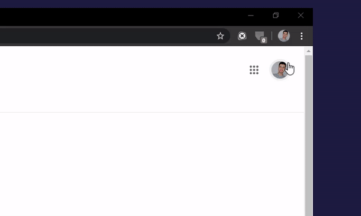

<h4 align="center">
    <a href="#">
        
    </a>
    <br>
    <br>

Track your meeting / Absence student.

[](#) [](https://github.com/hamzABellkhadir)

</h4>

<br>

# HB Meet

- 🤯 dowloading HB_Meet extension
- 🗃️ tracking your student
- 📈 make task __more easy__ for teacher (Absence registration)
- 📟 By: hamza belkhadir, ENSET-M

<br>

[](./../../)

## Install

```sh
# Install globally (recommended).
go to google chrome store

# HB_Meet.
rechercher HB_Meet
```
<h4 align="center">
    <a href="#">
        
    </a>
</h4>

<br>

[](./../../)

## Usage

### how use it?

```sh
# Enable extension.
click in to button for enable mode 

# Disable extension.
click in to button for disabled mode

# Badge counter.
represent "number of students" assist in your meeting live in google meet
```
<h4 align="center">
    <a href="#">
        
    </a>
</h4>


### input/output

```sh
# Click in to participants.
scroll down at the same time "HB Meet" scan the names of all  participants

# Attach your excel file.
the excel file should have the "name" or "last name" property 

# The result.
into the excel file we add a property "date", and we specify "present(P) or absent(A)" students
```
#### prepare your excel file that continent students list

<h4 align="center" style="margin: 5px;">
<a href="#">
        
</a>
</h4>

#### the badge represents number of selected students

<h4 align="center" style="margin: 5px;">
<a href="#">
        
</a>
</h4>


### choose your prepared file, and automatically we have prepared the new excel file, which contains the list of absences students

<h4 align="center" style="margin: 5px;">
<a href="#">
        
</a>
</h4>

### repeating gets the same results but adding another column with another date

<h4 align="center" style="margin: 5px;">
<a href="#">
        
</a>
</h4>

